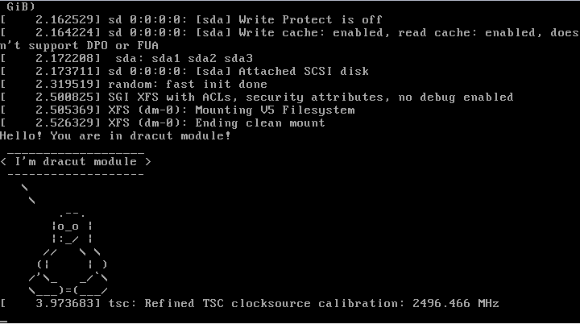

Попасть в систему без пароля несколькими способами

Способ 1. init=/bin/sh

В конце строки начинающейся с linux16 добавляем 
init=/bin/sh и нажимаем сtrl-x для загрузки в систему
В целом на этом все, Вы попали в систему.  
Рутовая файловая система при этом монтируется в режиме Read-Only. 
Если вы хотите перемонтировать ее в режим Read-Write можно воспользоваться командой:

[root@otuslinux ~]# mount -o remount,rw /

После чего можно убедиться записав данные в любой файл или прочитав вывод команды:

[root@otuslinux ~]# mount | grep root

​

Способ 2. rd.break

В конце строки начинающейся с linux16 добавляем rd.break и нажимаем сtrl-x для загрузки в систему

Попадаем в emergency mode. 

Наша корневая файловая система смонтирована (опять же в режиме Read-Only, но мы не в ней. 

Далее будет пример как попасть в нее и поменять пароль администратора:

В конце строки начинающейся с linux16 добавляем rd.break и нажимаем сtrl-x для загрузки в систему

Попадаем в emergency mode. Наша корневая файловая система смонтирована (опять же в режиме Read-Only, но мы не в ней. Далее будет пример как попасть в нее и поменять пароль администратора:

[root@otuslinux ~]# mount -o remount,rw /sysroot

[root@otuslinux ~]# chroot /sysroot

[root@otuslinux ~]# passwd root

[root@otuslinux ~]# touch /.autorelabel

После чего можно перезагружаться и заходить в систему с новым паролем.
Полезно когда вы потеряли или вообще не имели пароль администратор

После чего можно перезагружаться и заходить в систему с новым паролем. Полезно когда вы потеряли или вообще не имели пароль администратор.

​

Способ 3. rw init=/sysroot/bin/sh

В строке начинающейся с linux16 заменяем ro на rw init=/sysroot/bin/sh и нажимаем сtrl-xдля загрузки в систему

В целом то же самое что и в прошлом примере, но файловая система сразу смонтирована в режим Read-Write

В прошлых примерах тоже можно заменить ro на rw

​

Первым делом посмотрим текущее состояние системы:

[root@otuslinux ~]# vgs  
VG   #PV #LV #SN Attr   VSize   VFree  VolGroup00   1   2   0 wz--n- <38.97g0

Нас интересует вторая строка с именем Volume Group●Приступим к переименованию:

[root@otuslinux ~]# vgrename VolGroup00 OtusRoot

Volume group "VolGroup00" successfully renamed to "OtusRoot"

Установить систему с LVM, после чего переименовать VG

Далее правим /etc/fstab, /etc/default/grub, /boot/grub2/grub.cfg. 

Везде заменяем старое название на новое. 

По ссылкам можно увидеть примеры получившихся файлов.

Пересоздаем initrd image, чтобы он знал новое название Volume Group

[root@otuslinux ~]# mkinitrd -f -v /boot/initramfs-$(uname -r).img $(uname -r)

...*** Creating image file done ****** Creating initramfs image file '/boot/initramfs-3.10.0-862.2.3.el7.x86_64.img' done ***

После чего можем перезагружаться и если все сделано правильно успешно грузимся с новым именем Volume Group и проверяем:

[root@otuslinux ~]# vgs  

VG   #PV #LV #SN Attr   VSize   VFree  OtusRoot   1   2   0 wz--n- <38.97g0

При желании можно так же заменить название Logical Volume

​

Добавить модуль в initrd Скрипты модулей хранятся в каталоге 

/usr/lib/dracut/modules.d/. 

Для того чтобы добавить свой модуль создаем там папку с именем 01test:

[root@otuslinux ~]# mkdir /usr/lib/dracut/modules.d/01test

В нее поместим два скрипта:

1.module-setup.sh - который устанавливает модуль и вызывает скрипт test.sh

2.test.sh - собственно сам вызываемый скрипт, в нём у нас рисуется пингвинчик

Примеры файлов по ссылкам.

Добавить модуль в initrd

Пересобираем образ initrd
[root@otuslinux ~]# mkinitrd -f -v /boot/initramfs-$(uname -r).img $(uname -r)

или

[root@otuslinux ~]# dracut -f -v

Можно проверить/посмотреть какие модули загружены в образ:

[root@otuslinux ~]# lsinitrd -m /boot/initramfs-$(uname -r).img | grep test

После чего можно пойти двумя путями для проверки:○Перезагрузиться и руками выключить опции rghb и quiet 

и увидеть вывод○Либо отредактировать grub.cfg убрав эти опции

В итоге при загрузке будет пауза на 10 секунд и вы увидите пингвина 

в выводе терминала

​

